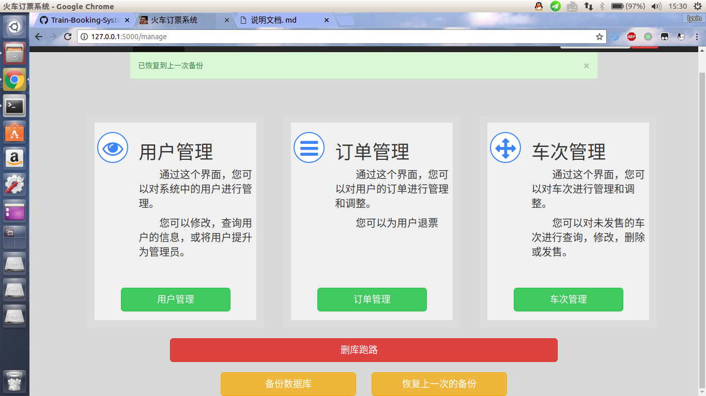

# 火车票订票系统使用说明

## 概要

本项目实现了一个简易的,类似12306的火车站订票系统.
用户可以通过网页查询火车,购票,查询订单等等.

## 用户基本功能

### 用户注册

- 点击右上角注册按钮,进入注册页面

- 按照提示,输入正确的个人信息后弹窗提示成功

### 修改个人信息

- 在右上角点击当前用户,找到`我的个人信息`,点击进入修改页面

- 输入正确的密码与修改后的个人信息,点击`修改个人信息`按钮即可

- 修改成功啦!

### 查询车票

在首页输入查询日期与地点,点击右侧`查询`按钮

可在下方选择列车种类,但是需要重新点击`查询`按钮

### 购买车票

点击右侧按钮,输入购买车票张数

### 查询订单

- 在右上角点击当前用户,找到`我的订单`,点击进入查询页面

- 输入日期,即可查询当天的车票

## 管理员特权

点击上方`管理`按钮,进入管理界面

### 管理用户

- 搜索*UID*查看用户信息

#### 更改用户权限

- 需要您本身权限够高

- 修改成功后会跳转回自己的个人信息

### 管理订单

- 可以查看所有用户的订单

- 可以帮用户退票

- 成功啦

### 管理车次

#### 查询车次

- 点击`车次管理`,进入车次管理页面,输入TrainID即可查询

##### 删除/发售车次

- 点击删除/发售按钮即可删除/发售
- **已发售的车次无法再删除**

#### 添加车次

- 点击`添加车次`,按照提示输入信息即可添加车次
- **P.S.:时间的格式必须是`xx:xx`,比如`08:00`**
- **P.P.S.:添加车次后并不会发售,需要发售请参考上一条**

### 数据备份

- 点击`备份数据库`按钮即可

- 点击恢复按钮即可,恢复至上次保存的版本

### ~~删库跑路~~

- 危险操作,需要最高权限以及确认密码

## 特性

### ~~反人类验证码~~
### ~~短信验证~~
